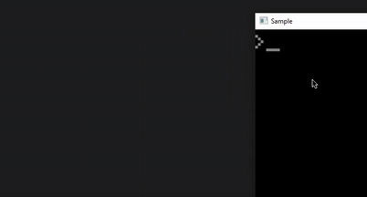
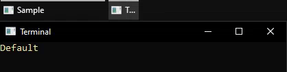

# KernelTerminal
A lightweight C# library that uses native interop to manage a console window. It can be useful when you need a console in a non-console application - for anything: logging, manipulation, etc. It allows you to open the console whenever you want and use it however you want!
<p align="center">
  Opening and using the console
</p>

<p align="center">
  
</p>

You can also use it if you want to get around any wrappers (like Windows Terminal) or make the opened console a main application. To do it, you need to create a console project, then hop into the project properties -> Output type and select "Windows application" instead of "Console application". Then simply call `Terminal.Open` at the beginning of the Main method.

## Known Issue
If you opened the console window as seconadry window of an application and the console is closed manually or its process is terminated (e.g., through Task Manager), 
the **main application thread is also terminated** ([Media](Media/closeissue.gif)). This happens because the console process is linked to the main application thread, and closing it forces the entire application to stop.
To avoid this, **do not close the console manually** — use `Terminal.Close()` instead.

## Styles
KernelTerminal supports different window styles meaning that you can hide the buttons and the process of the console in the taskbar. 
<p align="center">
  
</p>

\
In code, there is `WindowStyle` enum to manage it:
```csharp
Terminal.Open(WindowStyle.Default);
Terminal.Open(WindowStyle.ButtonsHidden); 
Terminal.Open(WindowStyle.ProcessHidden);
Terminal.Open(WindowStyle.ButtonsHidden | WindowStyle.ProcessHidden);
```
