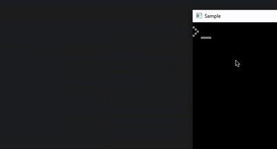
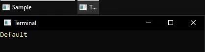

# KernelTerminal
A lightweight C# library that uses native interop to manage a console window. It can be useful when you need a console in a non-console application - for anything: logging, manipulation, etc. It allows you to open the console whenever you want and use it however you want!
<p align="center">
  Opening and using the console
</p>

<p align="center">
  
</p>

You can also use it if you want to get around any wrappers (like Windows Terminal) or make the opened console a main application. You'll need to create a **Console Project**, then hop into the project properties -> **Output type** and select **Windows application** instead of **Console application**. Then just call `Terminal.Open()` when needed.

## API

### Lifecycle
```csharp
// Allocate a new console window.
bool success = Terminal.Open(WindowStyle style = WindowStyle.Default);

// Free the current console window and reset its internal state.
bool success = Terminal.Close();

// Re-open the terminal window. (no window style reset)
Terminal.New();
```

### IO
There's `Terminal.IO` property to work with input and output. It's `ITerminalProperty` which defines what `Terminal.WriteLine`, `Terminal.ReadLine`, and some other IO logic does.
> [!NOTE]
> Methods `Terminal.WriteLine`, `Terminal.ReadLine`, and others are needed for clarity. There's no difference if you use methods listed in `Terminal.IO` instead. 

By default all of them are transferred to `System.Console` (by `SystemConsoleIO` class), but you may use your own logic.
```csharp
class MyIO : ITerminalIO
{
    public void Write(string value)
    {
        throw new NotImplementedException();
    }
    public void WriteLine(string value)
    {
        throw new NotImplementedException();
    }
    public void Clear()
    {
        throw new NotImplementedException();
    }

    public ConsoleKeyInfo ReadKey(bool intercept = false)
    {
        throw new NotImplementedException();
    }

    public string ReadLine()
    {
        throw new NotImplementedException();
    }
}
```
Then you'll have to set the new IO
```csharp 
Terminal.IO = new MyIO();
```

## Styles
KernelTerminal supports different window styles - you can hide the buttons and the tab of the console in the taskbar. 
<p align="center">
  
</p>

\
There is `WindowStyle` enum to manage it:
```csharp
Terminal.WindowStyle = WindowStyle.Default;
Terminal.WindowStyle = WindowStyle.ButtonsHidden; 
Terminal.WindowStyle = WindowStyle.TabHidden;
Terminal.WindowStyle = WindowStyle.ButtonsHidden | WindowStyle.TabHidden;
```

## Method Exporting
Even though there's almost no profit for exporting methods, KernelTerminal exports some! There are they:
```csharp 
bool OpenTerminal(int style);
bool CloseTerminal();

void SetTerminalFontSize(short width, short height);
void SetTerminalVisible(int visible); //0 = false

int* GetWindowHandle();
```
You can import and use these in other languages than C#. 

# Known Issue
If you opened the console window as seconadry window of an application and the console is closed manually or its process is terminated (e.g., through Task Manager), 
the **main application thread is also terminated** ([Media](Media/closeissue.gif)). This happens because the console process is linked to the main application thread, and closing it forces the entire application to stop.
To avoid this, **do not close the console manually** — use `Terminal.Close()` instead.
